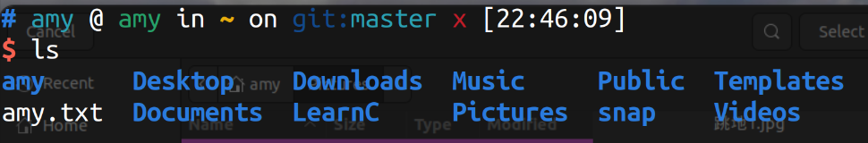
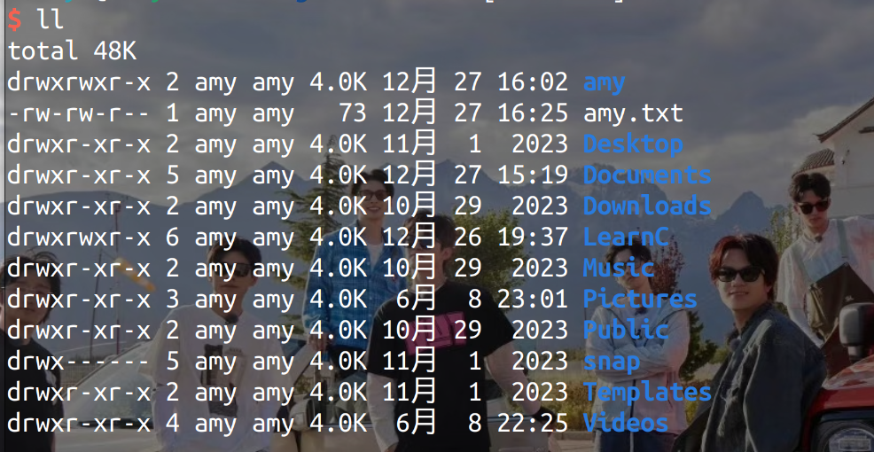

# 学习笔记

## 2024.6.8

今天开始要重新学习frank啦

### 003 Linux 命令

ls:展示出当前文件所有文件夹和文件(不包括隐藏文件)

ll：显示出文件形式以及日期、所属用户等。

## 2024.8.27

### 004 linux根目录

- Windows中有盘符，是用来定位的，但是Linux中没有盘符的概念。
- **linux一切皆文件**
- ~ ：用户根目录，home目录
- 最终目录，根目录：cd ./ ，cd是切换的意思

### 005 Linux根目录解析

- /bin：二进制目录

- /etc：系统配置文件

- /home：主目录，显示所有用户目录

- /lib：库目录

- /mnt：挂载目录（理解为外在设备和电脑连接）

- /proc：伪文件系统（和配置内核有关）

- /run：运行目录

- /tmp：临时目录

- /var：可变目录

- /boot：启动目录

- /dev：设备目录

- /media：媒体目录

- /opt：可选目录

- /root：管理员目录（用户主目录）

- /sbin：系统二进制目录

- GNU：高级管理员使用的命令工具

- /srv：服务目录，本地目录

- FHS：文件系统层级标准

  **sudo rm -rf/*：调用管理员身份输入密码删除**

  ## 006 cd命令

  cd：这个命令指的是切换到某个文件夹下

cd ~：切换到用户目录 

cd ：直接切换到用户目录

cd . :切换到当前目录

cd ..：切换到上一级目录

cd /：返回根目录

cd ../..：返回上两级目录

pwd：输入当前目录

### 007 Ctrl+C在Linux上是什么？

在Windows中代表复制

但在Linux中，输入命令时，表示强制退出，复制是Ctrl+shift+C键

**Linux中没有撤销的概念**，终端里不允许撤销

### 008 绝对路径

文件目录：绝对路径和相对路径

绝对路径：找到一个软件的位置要给全路径

在Windows中是从盘符开始的（盘符:\文件夹\\...\文件名.文件后缀）

### 009 相对路径

相对路径**一定要设置背景（前提），即在哪里**

目标相对于前提而言在哪里

### 010 Linux上的路径

绝对路径从根目录“/”开始

输入gedit+空格+绝对路径 可以打开文件

相对路径：要把路径最前面的斜杠去掉，或者加./或者直接给全局路径（前面加个~）也可以

**如果不去斜杠，文件中就不显示“~”，而是变成了根目录下面的文件了**

