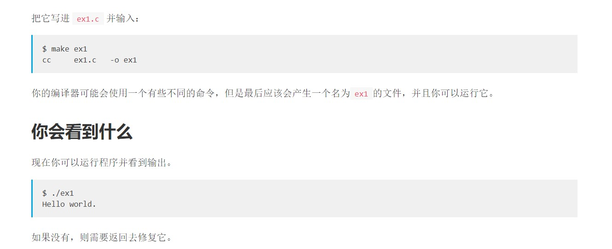

# Learn C the way 笔记

- 今后我就会在这里更新Learn C the way 的心得和笔记了

## EX1

- emm怎么说呢，在第一步操作的时候我好像就犯了一个比较低级的错误吧（其实也可以算经验吧

- 可以看到第一条需要输入$ make ex1对叭，我犯了什么错误呢，连ex1.c都没有创建就直接让它执行，我试了好几遍死活不行，全是出错误，后来问了赵总才知道要创.c文件哈哈哈哈哈，创建之后就好说了

