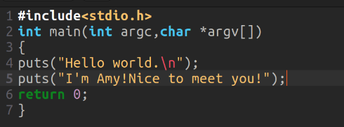
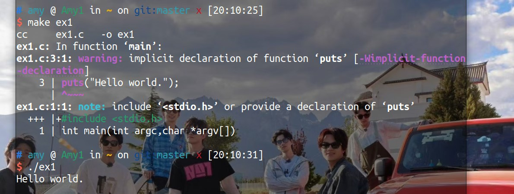

# Learn C the way 笔记

- 今后我就会在这里更新Learn C the way 的心得和笔记了

## EX1

### 第一个简单程序

- emm怎么说呢，在第一步操作的时候我好像就犯了一个比较低级的错误吧（其实也可以算经验吧

- 可以看到第一条需要输入$ make ex1对叭，我犯了什么错误呢，连ex1.c都没有创建连代码都没有打进文件中就直接让它执行，我试了好几遍死活不行，全是出错误，后来问了赵总才知道要创建.c文件哈哈哈哈哈，创建之后就好说了。创建完.c文件后，我们还需将下列代码写进你所创建的.c文件中

- 随后在根据最上面的命令执行，就可以成功了。
- 下面是我的实操

- 在我上面的操作中，我并没有加#include <stdio.h>，那么加上这句代码后我们就可以看到警告全部消失了。

- 当我删掉代码当中int 一行时，出现了以下情况

它会告诉我出错（这其实附加题的内容了），删return 0 ；是一点变化都没有的。

- 小曾同学遇到了一个问题，她代码也写进.c文件了，为什么执行make ex1的时候不成功嘞？

你猜问题出在哪里了，好家伙，代码应该写的是puts，她写的printf
