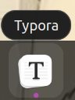

# 小白第一次用博客www

## 博客上传更新~

- 在blog文件夹中，有一个名叫auto-update-this-repo.sh的文件
- 在blog文件夹内右键，点击open in terminal,输入bash a之后点击tab键补全，点击回车。

## 新建文件~

- 在文件夹内右键，点击open in terminal，输入touch 文件名.md
- 记得在touch后加空格，.md是文件的类型
- 创建后，右键选择open with other application，点击View all applications，找到,点击它随后点击右上角的select就OK了。

## 如何联网~

以下三条代码是关键！！！

- sudo service NetworkManager stop
- sudo rm /var/lib/NetworkManager/NetworkManager.state
- sudo service NetworkManager start

## 如何使用Markdown~

### 标题

- 一级：#
- 二级：##
- 三级：###

### 无序列表

使用“-”或者“*”

### 引用

使用“>”

## 图片上传

- 曾某某同学想学习如何上传图片，接下来的步骤给大家借鉴哈哈哈

### 代码如下

→→“”