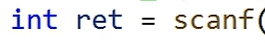
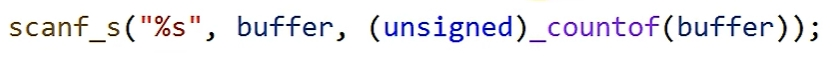
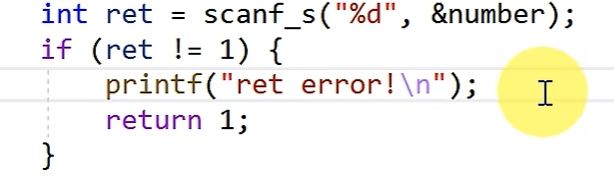
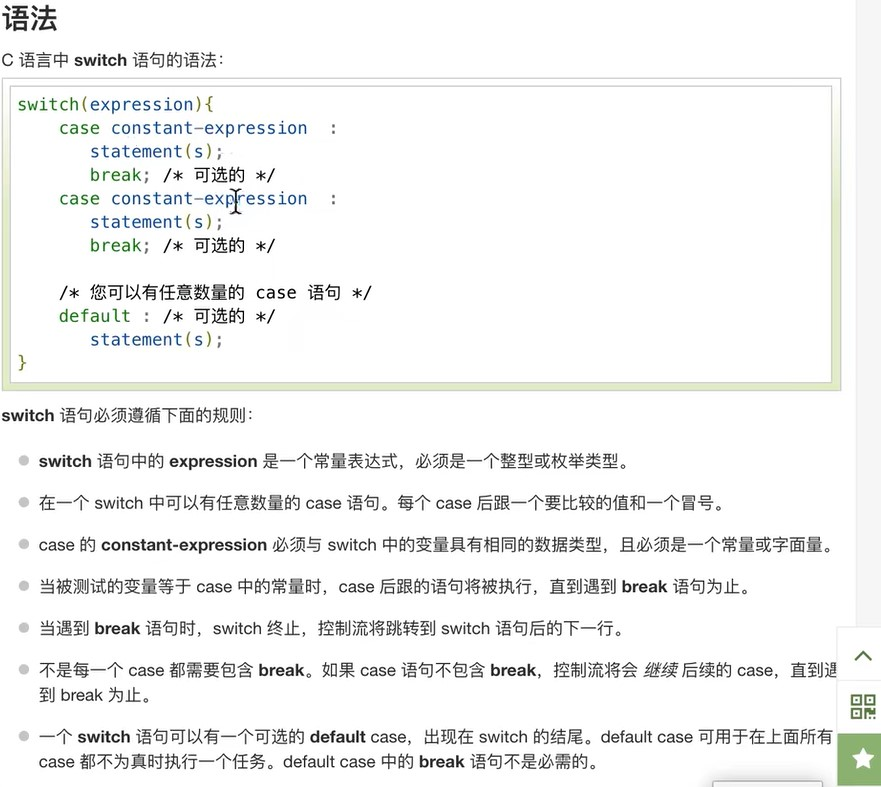
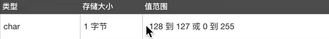
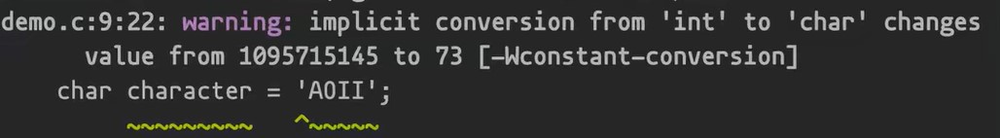
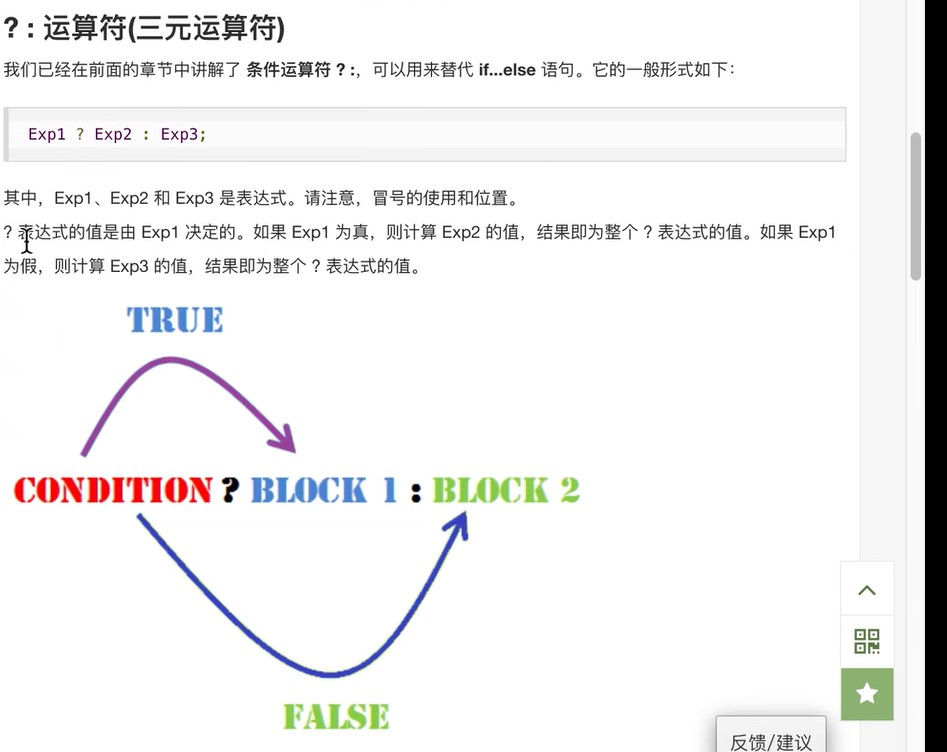

frank C学习日记

## 忽略警告问题

- 微软认为scanf是不安全的，只需要在最上行加入以上代码即可；

- 只加上方内容依旧会存在波浪号出现的问题，所以最好在scanf前加入int ret = ；

  

## 准确问题

在输入数组时，最准确的是在scanf函数中最后加入(unsigned)_countof(变量)，如下图

## 对scanf函数进行检测（虽然说不会考吧，但还是要看看）

检测内容例子如下图

忘记了呜呜呜，在努力记笔记重温中~

## switch 用法

我认为这个东西还蛮重要的，尤其是

case后要跟比较的值和冒号，我每次试验的时候老把冒号忘掉，还有建议还是加上break会好一点。

**default 表示的是默认值！！！

## char类型

- 一个char类型存储大小为一个字节
- 下面是一个典型错误

## ASCII码

这个ASCII码其实也挺重要的，慢慢熟悉⑧

## 三元运算符

三元运算符这个前两天上程序课的时候简单过了一下，我感觉这个东西还是很好理解的~

家人们，生病了，医生建议我先歇三天，含泪给自己放五天假不用上课了，我身体好点了就会更新的，不会拖太久的，等我病好叭哈哈~
