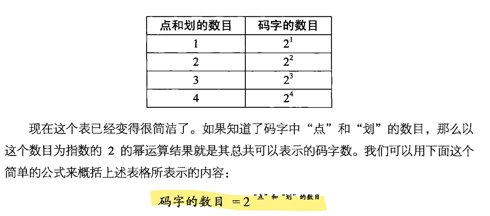
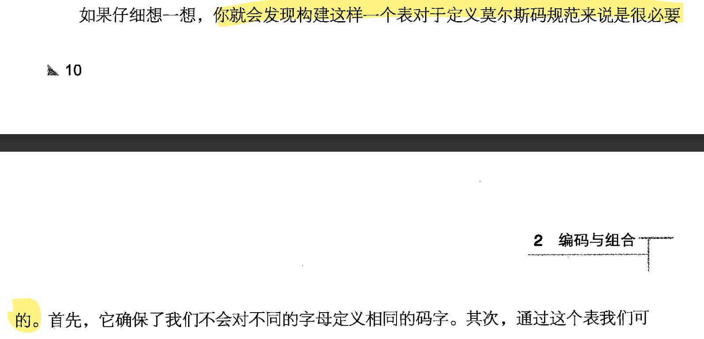
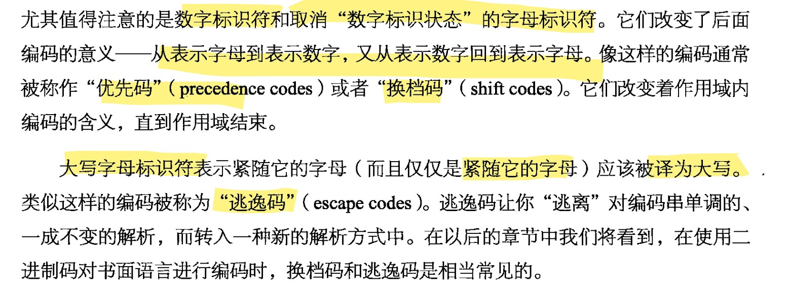
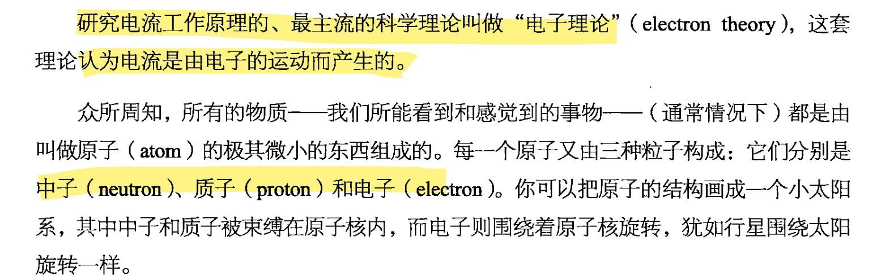

# 编码书笔记

## 1

- 首先摩尔斯密码大家应该都很熟悉啦，由点和划组成，不能区分大小写字母

## 2

- 码字数的计算方法可以从上方的图片得知，现在看懂了，之前看书的时候有点迷迷糊糊的，后来一想，我当时为什么就不懂呢（hhhh

- 这个表的确很重要，不然你完全不懂码字数是多少

## 3

- 认识了布莱叶盲文，同时也学了换挡码和逃逸码是什么，目前来看还是大部分可以理解的

## 4

- 上面的内容其实在我们高中学物理的时候都见过，其实化学的原电池也讲过一点点，其实只要高中知识学会了就很好理解什么是电子得失